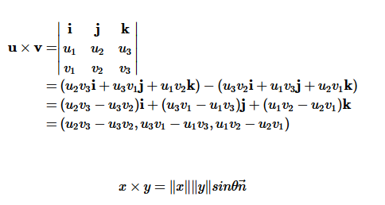

### Python库-NumPy

#### 简介
* 一个N维数组对象
* 用于处理线性代数， 傅里叶变换 和 随机数等

#### NumPy的几个基本属性
ndarray 代表一个NumPy对象,其具有如下属性</br>
* ndarray.ndim 数组的维数, (一维，二维，三维...等)
* ndarray.shape 一个整数元组用来表示numPy数组的行列信息。 如(2,3) 代表一个2行3列的矩阵
* ndarray.size NumPy数组的元素个数。 为shape属性各个元素的乘积
* ndarray.dtype 元素的数据类型
* ndarray.itemsize 每个元素占得字节数
* ndarray.data ndarray在内存中的地址


#### 创建一个ndarray
* array()， 接受一个 列表或者 元组作为参数创建一个 ndarry 对象， array()函数同时可以指定dtype的值
* zeros(),  接收一个元组指定shape 创建一个ndarray， 其元素的值为0
* ones(), 接收一个元组指定shape 创建一个单元矩阵
* arange(), 通过指定最小值，最大值和间隔 来创建一个一维数组， 最小值和间隔的默认值分别为 0， 1
* linspace(), 通过指定最小值，最大值和元素个数 来创建一个一维数组
* random对象， 通过创建一个random对象，再用过random对象的random方法创建矩阵

```python
#示例代码
import numpy as np
nparr1 = np.array(([2,4],[1,2],[2,3]), dtype=complex)
nparr2 = np.array([[1,2],[3,4],[5,6]], dtype=int)
nparr3 = np.arange(3, 21, 2)
zero = np.zeros((3,4,5))
one = np.ones((3,4))
ranarr = np.random.random((3,4))
print(nparr1)
print(nparr2)
print(nparr3)
print(zero)
print(one)
print(ranarr)
```

#### 基本操作
1. 算数运算</br>
**单个矩阵时，操作作用于每个矩阵的元素**</br>
**多个矩阵时，操作作用于每个矩阵的对应元素，矩阵的形状要一致**</br>
**运算并不会改变原矩阵的值**</br>
```python
nparr1 = np.arange(4)
nparr2 = np.arange(5, 9, 1)
print(nparr1 + nparr2)
print(nparr1 * nparr2)
print(np.sin(nparr1))
print(2 > nparr1)
```
2. 矩阵的点乘和叉乘</br>
* 向量的点乘(内积)<br/>
**公式：** `A▪B = a1*b1  + a2*b2 + ... = |A|*|B|*cosΘ`<br/>
**物理意义：** 是用过两个向量的夹角判断两个向量是否正交，和两个向量的相似性判断<br/>
**python函数：**  np.dot(A,B) 或者 A.dot(B)
* 向量的叉乘(外积)<br/>
**公式：** <br/>
  
**物理意义：**</br>
代表两个向量所构成的平行四边形的面积<br/>
判断两个向量是否平行<br/>
叉乘的结果仍然是一个向量<br/>
* 两个矩阵的相乘<br/>
`C = A▪B;  cij = ai▪bj`
3. 操作沿着某一维度进行<br/>
```python
import numpy as np
nparr1 = np.random.random((3,4))
print(nparr1)
print(nparr1.sum(axis=0))
print(nparr1.min(axis=1))
print(nparr1.min())
```
#### 索引，切分和迭代
```python
# 行迭代器
for row in nparr1:
    print(row)
# 元素迭代器
for e in nparr1.flat:
    print(e)
# 切分
print(nparr1[:1])  # 0-1行的所有列， 缺省代表所有
print(nparr1[1:, 1]) # 第一列以及从第一行开始的所有行
```

#### 改变矩阵的形状
* resize(), 接受一个元组来指定矩阵的形状，直接修改原数组
* reshape(), 接受一个参数列表来指定矩阵的形状，并不会修改原数组
* ravel(), 展开成一行
```python
import numpy as np
# 改变形状
nparr1 = np.floor(10 * np.random.random((4,5)))
print(nparr1)
nparr1.reshape(5,4)
print(nparr1)
nparr1.resize((5,4))
print(nparr1)
```


